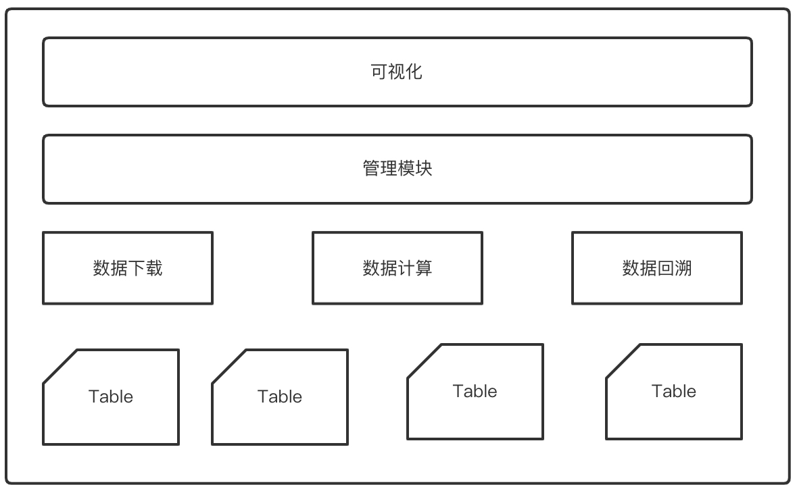

# `天数据回溯系统简介`
~~~~
现状：
1.原有设计：仅仅实现回溯功能，主要从功能上做了简单拆分
2.运行流程：历史数据下载->大数据加载到内存->回溯业务规则产出结果
3.部署方式：单台物理机全套服务
4.运行方式：一台物理机只支持一次回溯
5.面向B端

升级：
1.架构设计：分布式
2.运行流程：增加任务管理模块
3.部署方式：多集群部署
4.运行方式：支持单机群并行任务，提取通用服务，回溯相关服务流量染色

关于微服务架构：
管理模块总控，依赖mysql无状态化
管理模块依次推进历史数据下载模块、大数据计算模块、回溯业务模块
历史数据下载模块负责从消息队列消费，从离线hdfs下载，计算后存入mysql
大数据计算模块加载大量数据，主要用户大型计算场景
将回溯模块相关服务无状态化

关于工程目录结构划分:
基本上是简单古老的MVC结构，未使用依赖倒置原则设计为洋葱模型。
主要考虑：业务规则复杂，与非工程团队合作共建。

关于errgroup使用：
main中启动httpserver、pprof、manager等
manager启动对三块服务的轮询协成

关于error：
1。可视化API基于http，内部服务使用thirft
2.错误码分为对外和对内
3.error包使用：
错误收敛在main中、manager中，即每个协成入口点
循环逻辑对其他模块的调用，即每次迭代收敛错误
错误堆栈从mysql错误、rpc错误处开始

~~~~

