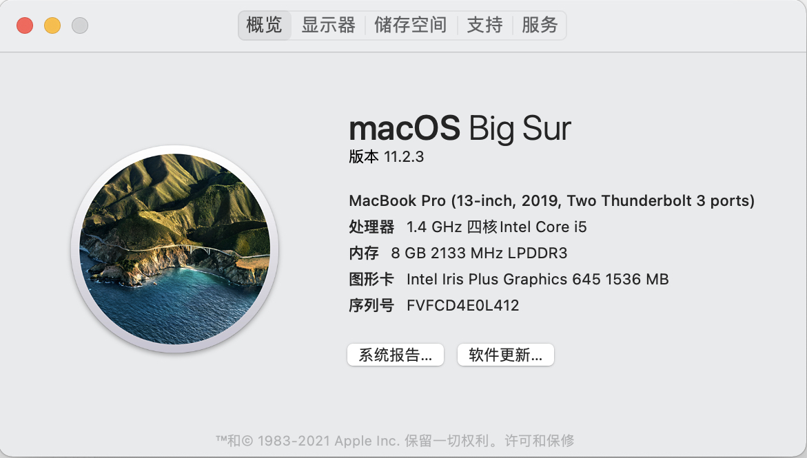

## redis bench mark

`1.使用 redis benchmark 工具, 测试 10 20 50 100 200 1k 5k 字节 value 大小，redis get set 性能。`

本机配置：

GET/SET

10bytes

~~~~
redis-benchmark -t set,get -d 10
 ====== SET ======
   100000 requests completed in 1.88 seconds
   50 parallel clients
   10 bytes payload
   keep alive: 1
   host configuration "save": 900 1 300 10 60 10000
   host configuration "appendonly": no
   multi-thread: no
 
 0.00% <= 0.2 milliseconds
 0.25% <= 0.3 milliseconds
 12.76% <= 0.4 milliseconds
 34.47% <= 0.5 milliseconds
 53.44% <= 0.6 milliseconds
 70.28% <= 0.7 milliseconds
 82.11% <= 0.8 milliseconds
 89.51% <= 0.9 milliseconds
 93.94% <= 1.0 milliseconds
 96.47% <= 1.1 milliseconds
 97.96% <= 1.2 milliseconds
 98.81% <= 1.3 milliseconds
 99.25% <= 1.4 milliseconds
 99.49% <= 1.5 milliseconds
 99.65% <= 1.6 milliseconds
 99.74% <= 1.7 milliseconds
 99.79% <= 1.8 milliseconds
 99.85% <= 1.9 milliseconds
 99.88% <= 2 milliseconds
 99.95% <= 3 milliseconds
 99.99% <= 4 milliseconds
 100.00% <= 4 milliseconds
 53078.56 requests per second
 
 ====== GET ======
   100000 requests completed in 1.88 seconds
   50 parallel clients
   10 bytes payload
   keep alive: 1
   host configuration "save": 900 1 300 10 60 10000
   host configuration "appendonly": no
   multi-thread: no
 
 95.48% <= 1 milliseconds
 99.98% <= 2 milliseconds
 100.00% <= 2 milliseconds
 53050.40 requests per second`
~~~~

20bytes

~~~~
redis-benchmark -t set,get -d 20
====== SET ======
  100000 requests completed in 1.89 seconds
  50 parallel clients
  20 bytes payload
  keep alive: 1
  host configuration "save": 900 1 300 10 60 10000
  host configuration "appendonly": no
  multi-thread: no

0.00% <= 0.2 milliseconds
0.17% <= 0.3 milliseconds
12.81% <= 0.4 milliseconds
35.13% <= 0.5 milliseconds
53.48% <= 0.6 milliseconds
69.26% <= 0.7 milliseconds
80.93% <= 0.8 milliseconds
88.69% <= 0.9 milliseconds
93.28% <= 1.0 milliseconds
96.04% <= 1.1 milliseconds
97.62% <= 1.2 milliseconds
98.62% <= 1.3 milliseconds
99.14% <= 1.4 milliseconds
99.39% <= 1.5 milliseconds
99.52% <= 1.6 milliseconds
99.59% <= 1.7 milliseconds
99.63% <= 1.8 milliseconds
99.66% <= 1.9 milliseconds
99.68% <= 2 milliseconds
99.84% <= 3 milliseconds
99.89% <= 4 milliseconds
99.94% <= 5 milliseconds
99.96% <= 6 milliseconds
99.99% <= 7 milliseconds
100.00% <= 7 milliseconds
52910.05 requests per second

====== GET ======
  100000 requests completed in 2.14 seconds
  50 parallel clients
  20 bytes payload
  keep alive: 1
  host configuration "save": 900 1 300 10 60 10000
  host configuration "appendonly": no
  multi-thread: no

89.25% <= 1 milliseconds
99.98% <= 2 milliseconds
100.00% <= 2 milliseconds
46707.14 requests per second
~~~~

50bytes 

~~~~
redis-benchmark -t set,get -d 50
====== SET ======
  100000 requests completed in 2.51 seconds
  50 parallel clients
  50 bytes payload
  keep alive: 1
  host configuration "save": 900 1 300 10 60 10000
  host configuration "appendonly": no
  multi-thread: no

0.00% <= 0.2 milliseconds
0.08% <= 0.3 milliseconds
8.83% <= 0.4 milliseconds
31.27% <= 0.5 milliseconds
50.12% <= 0.6 milliseconds
66.26% <= 0.7 milliseconds
77.70% <= 0.8 milliseconds
84.98% <= 0.9 milliseconds
89.47% <= 1.0 milliseconds
92.35% <= 1.1 milliseconds
94.05% <= 1.2 milliseconds
95.23% <= 1.3 milliseconds
96.04% <= 1.4 milliseconds
96.65% <= 1.5 milliseconds
97.07% <= 1.6 milliseconds
97.37% <= 1.7 milliseconds
97.62% <= 1.8 milliseconds
97.82% <= 1.9 milliseconds
97.99% <= 2 milliseconds
98.77% <= 3 milliseconds
99.17% <= 4 milliseconds
99.31% <= 5 milliseconds
99.38% <= 6 milliseconds
99.39% <= 7 milliseconds
99.40% <= 8 milliseconds
99.43% <= 9 milliseconds
99.44% <= 10 milliseconds
99.50% <= 11 milliseconds
99.53% <= 12 milliseconds
99.53% <= 13 milliseconds
99.54% <= 14 milliseconds
99.54% <= 15 milliseconds
99.60% <= 16 milliseconds
99.66% <= 17 milliseconds
99.68% <= 18 milliseconds
99.71% <= 19 milliseconds
99.75% <= 20 milliseconds
99.78% <= 21 milliseconds
99.82% <= 22 milliseconds
99.83% <= 23 milliseconds
99.90% <= 24 milliseconds
99.91% <= 25 milliseconds
99.92% <= 26 milliseconds
99.92% <= 27 milliseconds
99.93% <= 31 milliseconds
99.93% <= 32 milliseconds
99.93% <= 33 milliseconds
99.93% <= 35 milliseconds
99.94% <= 36 milliseconds
99.95% <= 92 milliseconds
99.97% <= 93 milliseconds
99.97% <= 94 milliseconds
99.98% <= 95 milliseconds
99.99% <= 96 milliseconds
99.99% <= 97 milliseconds
99.99% <= 98 milliseconds
100.00% <= 99 milliseconds
100.00% <= 99 milliseconds
39856.52 requests per second

====== GET ======
  100000 requests completed in 2.00 seconds
  50 parallel clients
  50 bytes payload
  keep alive: 1
  host configuration "save": 900 1 300 10 60 10000
  host configuration "appendonly": no
  multi-thread: no

95.13% <= 1 milliseconds
99.87% <= 2 milliseconds
99.99% <= 3 milliseconds
100.00% <= 3 milliseconds
50100.20 requests per second
~~~~

100bytes

~~~~
redis-benchmark -t set,get -d 100
====== SET ======
  100000 requests completed in 1.73 seconds
  50 parallel clients
  100 bytes payload
  keep alive: 1
  host configuration "save": 900 1 300 10 60 10000
  host configuration "appendonly": no
  multi-thread: no

0.00% <= 0.2 milliseconds
0.23% <= 0.3 milliseconds
16.74% <= 0.4 milliseconds
45.13% <= 0.5 milliseconds
64.43% <= 0.6 milliseconds
78.22% <= 0.7 milliseconds
87.08% <= 0.8 milliseconds
92.66% <= 0.9 milliseconds
95.81% <= 1.0 milliseconds
97.51% <= 1.1 milliseconds
98.49% <= 1.2 milliseconds
99.09% <= 1.3 milliseconds
99.43% <= 1.4 milliseconds
99.60% <= 1.5 milliseconds
99.71% <= 1.6 milliseconds
99.78% <= 1.7 milliseconds
99.83% <= 1.8 milliseconds
99.88% <= 1.9 milliseconds
99.91% <= 2 milliseconds
100.00% <= 2 milliseconds
57971.02 requests per second

====== GET ======
  100000 requests completed in 1.69 seconds
  50 parallel clients
  100 bytes payload
  keep alive: 1
  host configuration "save": 900 1 300 10 60 10000
  host configuration "appendonly": no
  multi-thread: no

97.58% <= 1 milliseconds
100.00% <= 1 milliseconds
59066.75 requests per second
~~~~

200bytes
~~~~
redis-benchmark -t set,get -d 200
====== SET ======
  100000 requests completed in 1.77 seconds
  50 parallel clients
  200 bytes payload
  keep alive: 1
  host configuration "save": 900 1 300 10 60 10000
  host configuration "appendonly": no
  multi-thread: no

0.00% <= 0.2 milliseconds
0.17% <= 0.3 milliseconds
15.01% <= 0.4 milliseconds
43.00% <= 0.5 milliseconds
63.30% <= 0.6 milliseconds
78.12% <= 0.7 milliseconds
87.21% <= 0.8 milliseconds
92.47% <= 0.9 milliseconds
95.67% <= 1.0 milliseconds
97.49% <= 1.1 milliseconds
98.46% <= 1.2 milliseconds
99.07% <= 1.3 milliseconds
99.39% <= 1.4 milliseconds
99.54% <= 1.5 milliseconds
99.65% <= 1.6 milliseconds
99.71% <= 1.7 milliseconds
99.75% <= 1.8 milliseconds
99.79% <= 1.9 milliseconds
99.82% <= 2 milliseconds
99.98% <= 3 milliseconds
100.00% <= 3 milliseconds
56465.27 requests per second

====== GET ======
  100000 requests completed in 1.83 seconds
  50 parallel clients
  200 bytes payload
  keep alive: 1
  host configuration "save": 900 1 300 10 60 10000
  host configuration "appendonly": no
  multi-thread: no

96.39% <= 1 milliseconds
99.97% <= 2 milliseconds
100.00% <= 2 milliseconds
54555.38 requests per second
~~~~

1000bytes 
~~~~
redis-benchmark -t set,get -d 1000
====== SET ======
  100000 requests completed in 1.76 seconds
  50 parallel clients
  1000 bytes payload
  keep alive: 1
  host configuration "save": 900 1 300 10 60 10000
  host configuration "appendonly": no
  multi-thread: no

0.00% <= 0.2 milliseconds
0.09% <= 0.3 milliseconds
16.14% <= 0.4 milliseconds
48.37% <= 0.5 milliseconds
68.00% <= 0.6 milliseconds
80.88% <= 0.7 milliseconds
88.57% <= 0.8 milliseconds
93.13% <= 0.9 milliseconds
95.84% <= 1.0 milliseconds
97.39% <= 1.1 milliseconds
98.29% <= 1.2 milliseconds
98.81% <= 1.3 milliseconds
99.13% <= 1.4 milliseconds
99.31% <= 1.5 milliseconds
99.41% <= 1.6 milliseconds
99.50% <= 1.7 milliseconds
99.56% <= 1.8 milliseconds
99.61% <= 1.9 milliseconds
99.65% <= 2 milliseconds
99.89% <= 3 milliseconds
99.98% <= 4 milliseconds
100.00% <= 5 milliseconds
56850.48 requests per second

====== GET ======
  100000 requests completed in 1.66 seconds
  50 parallel clients
  1000 bytes payload
  keep alive: 1
  host configuration "save": 900 1 300 10 60 10000
  host configuration "appendonly": no
  multi-thread: no

97.96% <= 1 milliseconds
99.94% <= 2 milliseconds
99.96% <= 3 milliseconds
100.00% <= 4 milliseconds
60096.15 requests per second
~~~~

5000bytes

~~~~
redis-benchmark -t set,get -d 5000
====== SET ======
  100000 requests completed in 1.79 seconds
  50 parallel clients
  5000 bytes payload
  keep alive: 1
  host configuration "save": 900 1 300 10 60 10000
  host configuration "appendonly": no
  multi-thread: no

0.00% <= 0.2 milliseconds
0.07% <= 0.3 milliseconds
12.69% <= 0.4 milliseconds
45.47% <= 0.5 milliseconds
65.22% <= 0.6 milliseconds
78.29% <= 0.7 milliseconds
86.34% <= 0.8 milliseconds
91.53% <= 0.9 milliseconds
94.86% <= 1.0 milliseconds
96.80% <= 1.1 milliseconds
97.92% <= 1.2 milliseconds
98.70% <= 1.3 milliseconds
99.11% <= 1.4 milliseconds
99.31% <= 1.5 milliseconds
99.42% <= 1.6 milliseconds
99.48% <= 1.7 milliseconds
99.52% <= 1.8 milliseconds
99.55% <= 1.9 milliseconds
99.59% <= 2 milliseconds
99.86% <= 3 milliseconds
99.96% <= 4 milliseconds
99.99% <= 5 milliseconds
100.00% <= 6 milliseconds
55772.45 requests per second

====== GET ======
  100000 requests completed in 1.71 seconds
  50 parallel clients
  5000 bytes payload
  keep alive: 1
  host configuration "save": 900 1 300 10 60 10000
  host configuration "appendonly": no
  multi-thread: no

97.75% <= 1 milliseconds
100.00% <= 1 milliseconds
58377.11 requests per second
~~~~

`2.写入一定量的 kv 数据, 根据数据大小 1w-50w 自己评估, 结合写入前后的 info memory 信息 , 分析上述不同 value 大小下，平均每个 key 的占用内存空间。`

~~~~
total= 10000 ,bytes= 10 ,avg = 88 ,memBeforeSet: 1153040 ,memAfterSet: 1241232
total= 10000 ,bytes= 20 ,avg = 104 ,memBeforeSet: 1153040 ,memAfterSet: 1205136
total= 10000 ,bytes= 50 ,avg = 138 ,memBeforeSet: 1153040 ,memAfterSet: 1180688
total= 10000 ,bytes= 100 ,avg = 186 ,memBeforeSet: 1153040 ,memAfterSet: 1171664
total= 10000 ,bytes= 200 ,avg = 282 ,memBeforeSet: 1153040 ,memAfterSet: 1167152
total= 10000 ,bytes= 1000 ,avg = 1091 ,memBeforeSet: 1153040 ,memAfterSet: 1163952
total= 10000 ,bytes= 5000 ,avg = 5200 ,memBeforeSet: 1153040 ,memAfterSet: 1163440
total= 20000 ,bytes= 10 ,avg = 88 ,memBeforeSet: 1153040 ,memAfterSet: 1329424
total= 20000 ,bytes= 20 ,avg = 104 ,memBeforeSet: 1153040 ,memAfterSet: 1257232
total= 20000 ,bytes= 50 ,avg = 138 ,memBeforeSet: 1153040 ,memAfterSet: 1208336
total= 20000 ,bytes= 100 ,avg = 186 ,memBeforeSet: 1153040 ,memAfterSet: 1190288
total= 20000 ,bytes= 200 ,avg = 282 ,memBeforeSet: 1153040 ,memAfterSet: 1181264
total= 20000 ,bytes= 1000 ,avg = 1091 ,memBeforeSet: 1153040 ,memAfterSet: 1174864
total= 20000 ,bytes= 5000 ,avg = 5192 ,memBeforeSet: 1153040 ,memAfterSet: 1173808
total= 50000 ,bytes= 10 ,avg = 93 ,memBeforeSet: 1153040 ,memAfterSet: 1618576
total= 50000 ,bytes= 20 ,avg = 109 ,memBeforeSet: 1153040 ,memAfterSet: 1425808
total= 50000 ,bytes= 50 ,avg = 136 ,memBeforeSet: 1153040 ,memAfterSet: 1289232
total= 50000 ,bytes= 100 ,avg = 184 ,memBeforeSet: 1153040 ,memAfterSet: 1245392
total= 50000 ,bytes= 200 ,avg = 280 ,memBeforeSet: 1153296 ,memAfterSet: 1223344
total= 50000 ,bytes= 1000 ,avg = 1082 ,memBeforeSet: 1153296 ,memAfterSet: 1207408
total= 50000 ,bytes= 5000 ,avg = 5203 ,memBeforeSet: 1153296 ,memAfterSet: 1205328
total= 100000 ,bytes= 10 ,avg = 93 ,memBeforeSet: 1153296 ,memAfterSet: 2084640
total= 100000 ,bytes= 20 ,avg = 109 ,memBeforeSet: 1153568 ,memAfterSet: 1699392
total= 100000 ,bytes= 50 ,avg = 136 ,memBeforeSet: 1153856 ,memAfterSet: 1426240
total= 100000 ,bytes= 100 ,avg = 184 ,memBeforeSet: 1153856 ,memAfterSet: 1338048
total= 100000 ,bytes= 200 ,avg = 280 ,memBeforeSet: 1153856 ,memAfterSet: 1293952
total= 100000 ,bytes= 1000 ,avg = 1082 ,memBeforeSet: 1153856 ,memAfterSet: 1262080
total= 100000 ,bytes= 5000 ,avg = 5203 ,memBeforeSet: 1153856 ,memAfterSet: 1257920
total= 500000 ,bytes= 10 ,avg = 90 ,memBeforeSet: 1153856 ,memAfterSet: 5678144
total= 500000 ,bytes= 20 ,avg = 106 ,memBeforeSet: 1154048 ,memAfterSet: 3816192
total= 500000 ,bytes= 50 ,avg = 141 ,memBeforeSet: 1154240 ,memAfterSet: 2565312
total= 500000 ,bytes= 100 ,avg = 189 ,memBeforeSet: 1154240 ,memAfterSet: 2099776
total= 500000 ,bytes= 200 ,avg = 285 ,memBeforeSet: 1154240 ,memAfterSet: 1867008
total= 500000 ,bytes= 1000 ,avg = 1080 ,memBeforeSet: 1154240 ,memAfterSet: 1694336
total= 500000 ,bytes= 5000 ,avg = 5194 ,memBeforeSet: 1154240 ,memAfterSet: 1673664
~~~~
